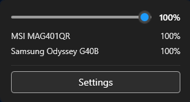
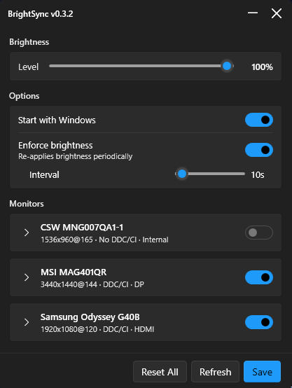

# BrightSync

  

BrightSync is a Windows app that keeps the brightness of your DDC/CI-compatible monitors in sync with a single global brightness value.

On laptops and other systems where Windows exposes the built-in brightness slider, BrightSync listens to that slider and mirrors the change to all supported external monitors. On desktops, or on systems where Windows does not provide a brightness slider, BrightSync gives you a tray icon with a quick brightness popup so you can control all supported monitors from one place.

## Screenshots

Quick Menu


Settings Menu


## How It Works

- If Windows has an internal-display brightness control, BrightSync syncs that value to your external monitors.
- If Windows does not have a brightness control, BrightSync uses its own tray slider as the global brightness source.
- BrightSync applies that global value to each enabled DDC/CI monitor.
- Per-monitor settings let you clamp or scale the final brightness for each display.

## Features

- Works on both laptops and desktops
- Syncs with the Windows brightness slider when Windows exposes one
- Tray icon with a quick popup slider for desktops and unsupported internal-brightness scenarios
- One global brightness value for all supported monitors
- Per-monitor enable or disable control
- Per-monitor minimum brightness
- Per-monitor maximum brightness
- Per-monitor brightness scaling multiplier
- Optional auto start with Windows
- Optional brightness enforcement that re-applies brightness if a monitor changes it
- Monitor refresh action from the tray or settings window
- Update check against GitHub releases

## Requirements

- Windows
- DDC/CI-compatible monitors for external brightness control

Notes:

- BrightSync can only control monitors that support DDC/CI brightness commands.
- If a monitor does not support DDC/CI, it will still appear in the app, but BrightSync cannot change its brightness.
- Windows may only show the native brightness slider on systems with a compatible internal display. When it does not, use the BrightSync tray slider instead.

## Install

1. Go to the [latest release](https://github.com/bberka/BrightSync/releases/latest).
2. Download the newest `.zip` file that matches your system.
3. Extract the zip to any folder.
4. Run `BrightSync.exe`.

If you are not sure which file to choose, try the `windows-x64-self-contained` zip first.

## Usage

1. Start BrightSync.
2. Change the Windows brightness slider if your system has one.
3. If Windows does not expose a brightness slider, use the BrightSync tray icon and quick popup slider.
4. Open `Settings` to configure monitor-specific behavior.

In settings, you can:

- Turn sync on or off for each monitor
- Set a minimum brightness per monitor
- Set a maximum brightness per monitor
- Apply a brightness multiplier per monitor
- Enable `Start with Windows`
- Enable periodic brightness enforcement and choose its interval

## Updates

BrightSync checks GitHub releases for updates and opens the releases page when a newer version is available.

## Builds and Releases

This repository uses GitHub Actions for releases.

- Workflow file: [`.github/workflows/release.yml`](.github/workflows/release.yml)
- Trigger: update the `VERSION` file and push to `main` or `master`
- Manual trigger: run the workflow from the GitHub Actions tab
- Output: release zip files for `win-x64` and `win-x86`, in both self-contained and framework-dependent versions

The workflow publishes the app, creates zip files, and uploads them to the matching GitHub release.

## Build Locally

Requirements:

- Windows
- .NET 10 SDK

Build:

```powershell
dotnet restore
dotnet publish BrightSync.csproj -c Release
```
