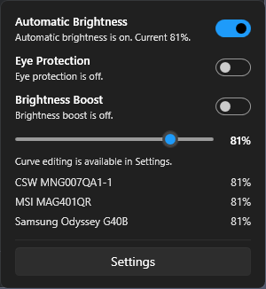
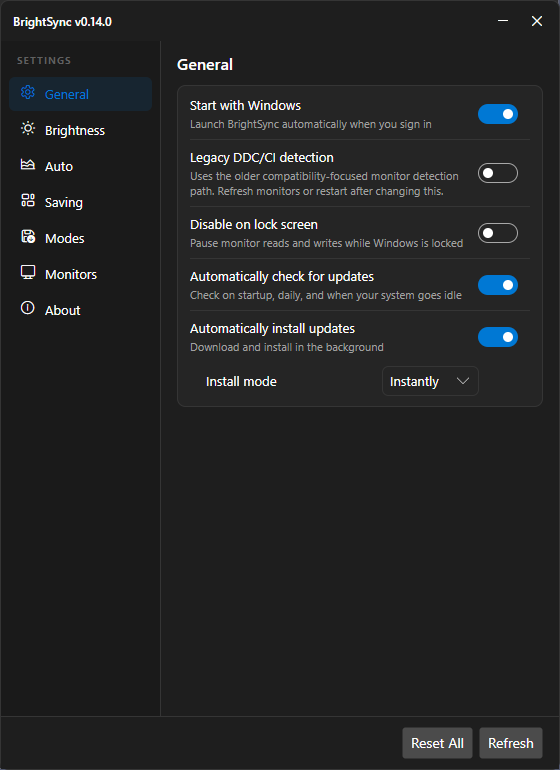
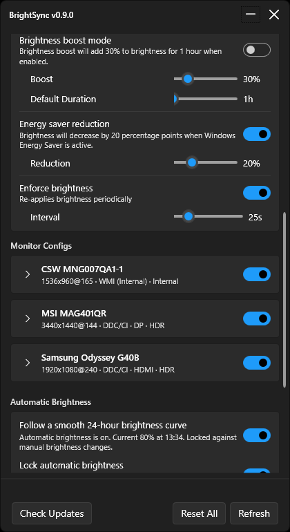
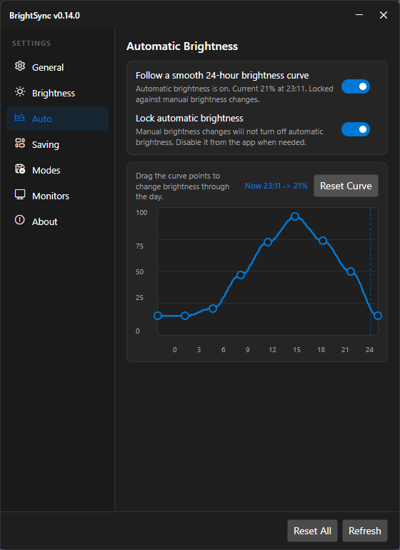

# BrightSync

  

> [!WARNING]
> **Pre-v1.0.0 Release**: This project is in active development and has not reached v1.0.0. Each version may introduce breaking changes to configurations, defaults, or features.

BrightSync is a Windows tray app that keeps the brightness of your monitors aligned to one shared master brightness value.

BrightSync provides its own master brightness control (available in the tray popup or settings menu) to manage all supported displays—including your laptop's built-in integrated screen and external DDC/CI monitors—from one place.

It also includes optional automatic brightness, idle dimming, per-monitor limits, and recovery features for monitors that forget their brightness after sleep or power changes.

## Design Philosophy

BrightSync is built around the philosophy of **"Configure once, and never think about monitor brightness again."**
- **Set and Forget**: Brightness rules, limits (min/max), multipliers, and curves are configured per-monitor once. The app handles the rest dynamically.
- **No Micromanagement**: Avoid unnecessary per-monitor brightness controls in the daily quick menus.
- **Extensible Integration**: Leverage a robust CLI engine rather than building bloated internal systems (e.g., custom hotkey managers).

## Screenshots

### Quick menu



### Settings window






## What BrightSync Does

- Uses one global master brightness value as the source for all enabled monitors.
- Supports independent master brightness control that does not rely on Windows' native slider.
- Treats the internal display (laptops) as a standard controllable target using a WMI backend.
- Applies brightness to external monitors through DDC/CI.
- Lets you adjust each monitor (both internal and external) with its own enable flag, minimum, maximum, and multiplier (ratio).
- Supports advanced monitor hardware controls (Contrast, Volume, RGB Gains, Color Presets, and Input Source) for compatible DDC/CI external monitors.
- Can drive brightness automatically from a 24-hour curve instead of manual input.

## Features

- Works on both laptops and desktops
- Tray icon with hover tooltip (displays current master brightness, mode, and active states) and quick brightness popup
- Independent master brightness slider in the tray or settings
- Automatic brightness based on a smooth 24-hour curve
- Visual curve editor in Settings
- Windows Energy Saver detection with configurable brightness reduction
- Quick "Eye Protection" mode (dimming) with configurable duration and reduction amount (applied to all targets including internal)
- Quick "Brightness Boost" mode (brightening) with configurable duration and increase amount (applied to all targets including internal)
- Per-monitor enable or disable control (both internal and external)
- Per-monitor minimum brightness, maximum brightness, and multiplier (ratios)
- Per-monitor hardware controls for external displays, allowing you to configure Contrast, Volume, RGB Color Gains (Red, Green, Blue), Color Presets, and active Input Source directly from the UI
- Optional idle dimming after inactivity
- Optional pause while Windows is locked
- Optional brightness enforcement to re-apply values if a monitor changes them
- Layered monitor detection with WMI and DisplayConfig fallbacks
- Layered brightness backends: WMI (Internal), low-level DDC/CI, Windows high-level monitor APIs, and write-only capability fallbacks
- Apple display and Apple Studio Display detection with backend diagnostics
- HDR-aware monitor metadata and safer enforcement behavior
- Per-monitor detection diagnostics in Settings
- Optional legacy DDC/CI detection mode for compatibility
- Refresh monitors from the tray or Settings window
- Configurable periodic monitor refresh to automatically recover lost DDC/CI connections
- CLI command routing for brightness and resident app actions
- Dynamic Windows system theme syncing (style changes apply automatically without restarting)
- Compiled with Native AOT for single-file, zero-dependency execution with low memory footprint and instant startup
- Start with Windows
- GitHub release update checks

## Requirements

- Windows
- One or more DDC/CI-compatible external monitors for external brightness control

Important notes:

- BrightSync controls external monitors through DDC/CI or high-level monitor APIs.
- Built-in laptop panels are controlled via WMI (WmiSetBrightness) and treated as a normal monitor target.
- A monitor may still appear in the app even if BrightSync cannot change its brightness.

## Install

1. Open the [latest release](https://github.com/bberka/BrightSync/releases/latest).
2. Download the `.zip` file you want.
3. Extract it anywhere.
4. Run `BrightSync.exe`.

If you are unsure which package to pick, start with the installer (e.g. `BrightSync-Setup-v0.16.0-win-x64.exe`).

## Daily Use

1. Start BrightSync.
2. Adjust brightness with the BrightSync tray icon and quick popup slider (or via the settings window).
3. Open `Settings` for monitor-specific options and advanced behavior.

Behavior to know:

- When automatic brightness is off, the slider works normally.
- When automatic brightness is on, BrightSync controls the brightness value and the slider becomes read-only.
- The quick popup includes `Automatic Brightness`, `Eye Protection`, and `Brightness Boost` toggles for fast control.
- Right-click the `Eye Protection` or `Brightness Boost` menus in the tray for time duration presets.
- Most settings changes are only persisted after clicking `Save`.

## Command Line

BrightSync also supports command-line commands through `BrightSync.exe`.

Resident-aware behavior:

- If BrightSync is already running in the tray, CLI commands are forwarded to the running app through a localhost-only command server.
- If BrightSync is not already running, only direct brightness commands run one-shot and then exit.
- Resident-only commands never auto-start the tray app.
- Manual CLI brightness commands respect automatic brightness. If automatic brightness is enabled, manual CLI brightness changes fail until auto mode is turned off.

One-shot-capable commands:

```powershell
BrightSync.exe brightness set 55
BrightSync.exe brightness up 10
BrightSync.exe brightness down 10
```

Resident-only commands:

```powershell
BrightSync.exe settings show
BrightSync.exe monitors refresh
BrightSync.exe auto on
BrightSync.exe auto off
BrightSync.exe eye-protection on
BrightSync.exe eye-protection on --hours 3
BrightSync.exe eye-protection off
BrightSync.exe boost on
BrightSync.exe boost on --hours 2
BrightSync.exe boost off
BrightSync.exe app exit
```

Startup behavior:

- `BrightSync.exe` starts the normal tray app.
- `BrightSync.exe --autostart` starts the resident tray app hidden, the same way Windows startup uses it.

## Settings Overview

### Brightness

- Adjust the shared brightness value when automatic brightness is off.

### Monitor Configs

- Enable or disable individual monitors.
- Clamp each monitor with minimum and maximum brightness.
- Scale a monitor brighter or dimmer with a multiplier.
- Expand any monitor row to see detection diagnostics, fallback details, and advanced hardware controls (if supported by DDC/CI).

#### Advanced Hardware Controls

If an external monitor supports DDC/CI capability command probing, expanding its row in **Settings** exposes additional hardware adjustments:
- **Contrast**: Adjust the display's hardware contrast value.
- **Volume**: Change the monitor's built-in speaker volume (if equipped).
- **RGB Gains (Color Warmth)**: Adjust individual Red, Green, and Blue subpixel gains to fine-tune color balance.
- **Color Presets**: Select from supported factory color temperatures and presets (such as *sRGB*, *Display Native*, *5000K*, *6500K*, *9300K*, or *User Defined*).
- **Input Source**: Digitally switch the active monitor video input (e.g. *HDMI 1*, *HDMI 2*, *DisplayPort 1*, *DisplayPort 2*, *USB-C*, *VGA*, *DVI*).

*Note on performance & persistence:* Sliders for Contrast, Volume, and RGB Gains utilize a 150ms debounce window to prevent stuttering and display lag during interactive dragging, while Color Preset and Input Source dropdowns apply instantly. All values are saved to the configuration file (`config.json`) and re-applied when the application starts or when monitors are refreshed.

### Automatic Brightness

- Enable a 24-hour brightness curve.
- Drag curve points in Settings to tune brightness through the day.
- `Lock automatic brightness` is a legacy toggle that is ignored as BrightSync handles display brightness independently from the native Windows slider.

### Other Options

- `Start with Windows`
- `Legacy DDC/CI detection`
- `Disable on lock screen`
- `Idle dimming`
- `Eye protection mode`
- `Brightness boost mode`
- `Energy saver reduction`
- `Brightness enforcement`
- `Check for updates`

## Compatibility and Troubleshooting

- BrightSync uses a layered detection pipeline. It combines DDC/CI enumeration with DisplayConfig and WMI-based metadata fallbacks to improve monitor naming and connection detection.
- BrightSync also uses layered external brightness control detection. If a low-level DDC/CI brightness read fails, it can fall back to the Windows high-level monitor API or a write-only capabilities path when supported by the display.
- Apple displays, including Apple Studio Display when Windows exposes a usable brightness backend, are identified in diagnostics.
- HDR-capable displays are detected through DisplayConfig. When HDR is active, BrightSync avoids aggressive brightness readback enforcement on that display.
- Open a monitor row in `Settings` to see which detection backend was used and what fallback path BrightSync took.
- If monitor detection is unreliable, enable `Legacy DDC/CI detection`, then refresh monitors or restart the app.
- `Legacy DDC/CI detection` uses a compatibility-focused enumeration path and may help on systems where richer metadata detection is unreliable.
- **Advanced Hardware Controls & Presets**: Some monitors lock or disable physical RGB gain adjustment controls on the hardware side when a specific Color Preset (e.g., sRGB) or picture mode is selected. If you find the Red, Green, or Blue sliders disabled or unresponsive, try changing the Color Preset dropdown to *User Defined* or *Display Native*. Additionally, internal laptop panels controlled via WMI do not support DDC/CI VCP features and will not show the Advanced Hardware Controls section.
- If `Disable on lock screen` is enabled, BrightSync pauses external monitor reads and writes while Windows is locked and refreshes monitors after unlock.
- Idle dimming can either scale targets down by a percentage or reduce each monitor (including the internal display) to its configured minimum brightness.
- Energy saver reduction automatically dims all monitors when Windows is in power saving mode.
- Eye protection mode provides temporary manual dimming by subtracting a fixed number of brightness points from all monitors.
- Brightness boost mode provides a temporary brightness increase by adding a fixed number of brightness points to all monitors.
- Eye protection mode and Brightness boost mode are mutually exclusive. Enabling one turns the other off.
- Brightness enforcement helps recover from monitors that reset brightness after sleep, power cycling, or input changes.
- Automatic brightness recalculates through the day and after resume or system time changes.

## Configuration

BrightSync stores its configuration at:

`%APPDATA%\BrightSync\config.json`

While the resident app is running, BrightSync also writes localhost command-server metadata at:

`%LOCALAPPDATA%\BrightSync\command-server.json`

## Updates

BrightSync can check GitHub releases for updates. If a newer version is found, it opens the releases page.

## Build Locally

Requirements:

- Windows
- .NET 10 SDK

Build:

```powershell
dotnet restore
dotnet publish BrightSync.csproj -c Release
```

## Release Automation

This repository uses GitHub Actions to build and publish releases.

- Workflow: [`.github/workflows/release.yml`](.github/workflows/release.yml)
- Automatic trigger: update `VERSION` and push to `main` or `master`
- Manual trigger: run the workflow from the GitHub Actions tab
- Output packages:
  - `win-x64` (portable zip and setup installer)
  - `win-arm64` (portable zip and setup installer)

The workflow reads the version from `VERSION`, publishes the app, creates zip archives, and uploads them to the matching GitHub release.
